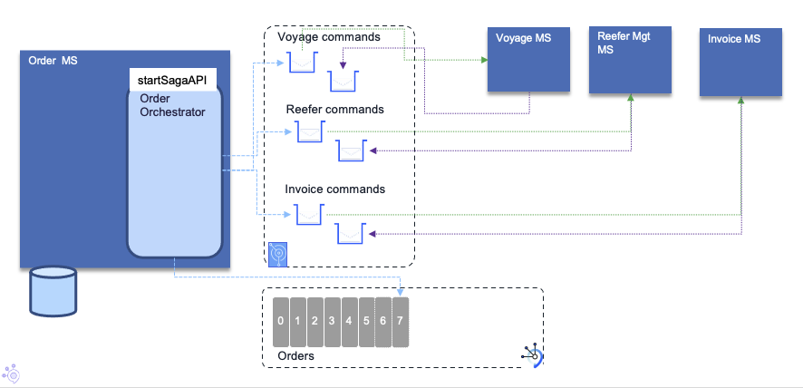

# KC Solution Order management command microservice with MQ

This microservice implement the Orchestration of the Saga pattern using MQ to support
th async request/response communication between Saga participant.



The application uses Quarkus 2.4.x, AMQP and Reactive messaging.

## Implementation approach

We are using JAXRS resources and DTO to define OpenAPI contract.

The resource class transforms DTO to an entity and emits event to Kafka to use it as an
append log and transaction. 


## Read more to understand the implementation

* [To understand the KContainer solution](https://ibm-cloud-architecture.github.io/refarch-kc/)
* [Getting started to Smallrye reactive messaging with AMQP](https://quarkus.io/guides/amqp)
* [AMQP clients communicating over IBM MQ](https://www.ibm.com/docs/en/ibm-mq/9.2?topic=mq-amqp-clients-communicating-over)
* [Developing JMS apps with Quarkus and GraalVM](https://developer.ibm.com/tutorials/mq-running-ibm-mq-apps-on-quarkus-and-graalvm-using-qpid-amqp-jms-classes/)
* [Apache Qpid for AMQP](https://qpid.apache.org/)

## Running the application in dev mode

You can run your application in dev mode that enables live coding using:
```shell script
./mvnw compile quarkus:dev
```

> **_NOTE:_**  Quarkus now ships with a Dev UI, which is available in dev mode only at http://localhost:8080/q/dev/.

## Packaging and running the application

The application can be packaged using:
```shell script
./mvnw package
```
It produces the `quarkus-run.jar` file in the `target/quarkus-app/` directory.
Be aware that it’s not an _über-jar_ as the dependencies are copied into the `target/quarkus-app/lib/` directory.

The application is now runnable using `java -jar target/quarkus-app/quarkus-run.jar`.

If you want to build an _über-jar_, execute the following command:
```shell script
./mvnw package -Dquarkus.package.type=uber-jar
```

The application, packaged as an _über-jar_, is now runnable using `java -jar target/*-runner.jar`.

## Creating a native executable

You can create a native executable using: 
```shell script
./mvnw package -Pnative
```

Or, if you don't have GraalVM installed, you can run the native executable build in a container using: 
```shell script
./mvnw package -Pnative -Dquarkus.native.container-build=true
```

You can then execute your native executable with: `./target/code-with-quarkus-1.0.0-SNAPSHOT-runner`

If you want to learn more about building native executables, please consult https://quarkus.io/guides/maven-tooling.html.

## Provided Code

### RESTEasy JAX-RS

Easily start your RESTful Web Services

[Related guide section...](https://quarkus.io/guides/getting-started#the-jax-rs-resources)
